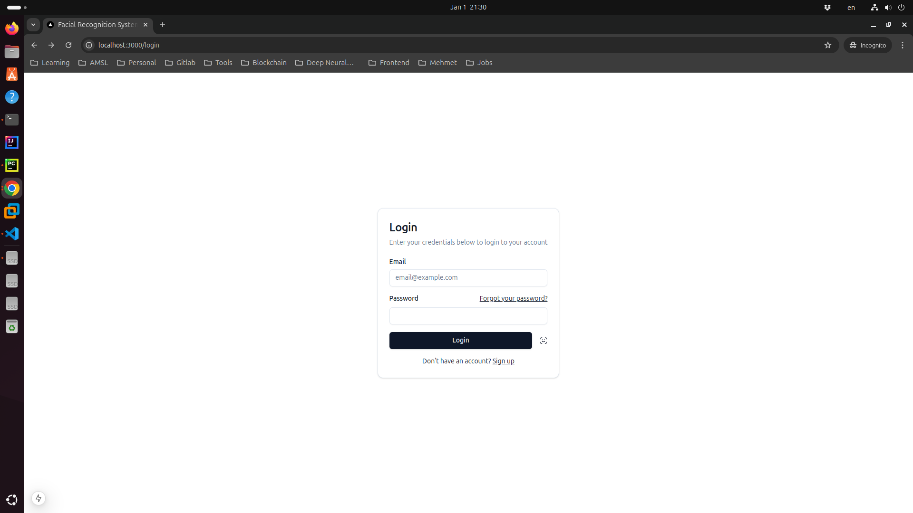
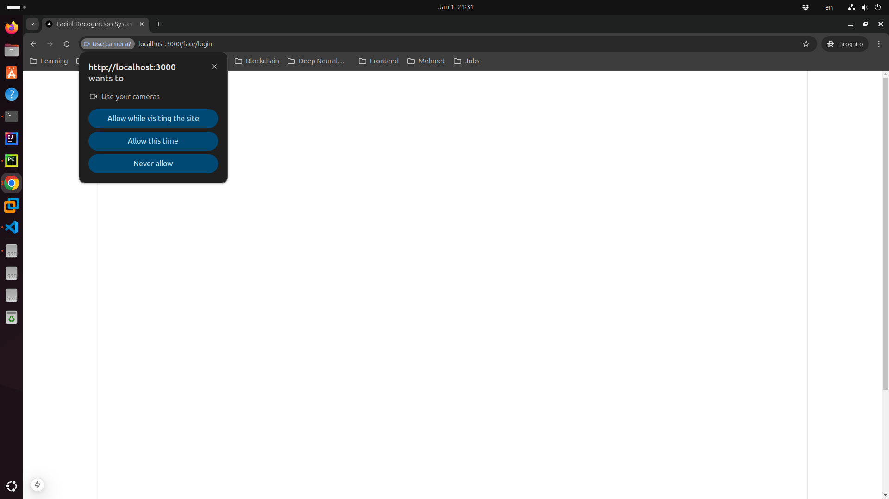

# Face Recognition Application

[](https://hub.docker.com/r/meheditech/frs-backend)

## Overview

**Face Recognition Application** is a cutting-edge facial recognition application built with modern technologies. It supports face detection, keypoint extraction and embedding generation. The app is optimized for high performance and accuracy, designed for use in identity verification, security and other facial recognition applications.

## Features

- **Face Detection**: Detect faces in real-time or static images.
- **Facial Landmarks Extraction**: Identify key facial points for advanced facial analysis.
- **Embedding Generation**: Generate facial embeddings for comparison and recognition.
- **API Support**: Provides RESTful APIs for integration.

## Technologies Used

- **Frontend**: React.js, Nextjs
- **Backend**: Python (FastAPI)
- **Face Detection - Backend**: PyTorch, RetinaFace
- **Face Recognition - Backend**: PyTorch, ArcFace
- **Face Detection - Frontend**: Tensorflowjs, Mediapipe
- **Database**: Qdrant (Vector Database), PostgreSQL (Optional for storage)
- **Containerization**: Docker

## Installation

### Prerequisites

Ensure you have the following installed:

- Node.js (v22 or higher)
- Python (v3.12 or higher)
- Docker (Optional, for containerized setup)
- CUDA Toolkit (Optional, for GPU acceleration)

### Steps

1. Clone the repository:

    ```bash
    git clone https://github.com/rabbicse/face-app.git
    cd face-app
    ```

2. Install dependencies for the frontend:

    ```bash
    cd frontend/frs_react
    npm install
    ```

3. Set up the backend:

    ```bash
    cd backend/frs
    pip install -r requirements.txt
    ```

4. Configure environment variables:

    - Create a `.env` file in the root directory.
    - Add the following variables:

      ```env
      NEXT_PUBLIC_API_HOST=http://localhost
      NEXT_PUBLIC_API_PORT=5000
      ```

5. Start the services:

    - Frontend:

      ```bash
      cd frontend/frs_react
      npm run dev
      ```

    - Backend:

      ```bash
      cd backend/frs
      uvicorn api.server:app --reload --host 0.0.0.0 --port 5000
      ```

6. Access the application:

    Open your browser and navigate to `http://localhost:3000`.

## Screenshots

### Login Page



### Login with Face Recognition



## API Endpoints

### 1. Detect Faces

**Endpoint:** `/api/v1/dnn/detect`

- **Method:** `POST`
- **Body:** `multipart/form-data`
  - `photo`: The image file for detection.
- **Response:**

  ```json
  {
    "status": "success",
    "faces": [
      {
        "bbox": {
          "x_min": 0.2697347104549408,
          "y_min": 0.1822991967201233,
          "x_max": 0.7142632007598877,
          "y_max": 0.7912323474884033,
          "score": 0.9963470101356506
        },
        "landmarks": {
          "left_eye": {
            "x": 0.3953465223312378,
            "y": 0.413769394159317
          },
          "right_eye": {
            "x": 0.5912481546401978,
            "y": 0.4187081754207611
          },
          "nose": {
            "x": 0.49022188782691956,
            "y": 0.5452162623405457
          },
          "left_lip": {
            "x": 0.4161381721496582,
            "y": 0.6275689005851746
          },
          "right_lip": {
            "x": 0.5787203907966614,
            "y": 0.6303802132606506
          }
        }
      }
    ]
  }
  ```

### 2. Extract Embeddings

**Endpoint:** `/api/v1/dnn/extract-embedding`

- **Method:** `POST`
- **Body:** `multipart/form-data`
  - `photo`: The image file for embedding extraction.
- **Response:**

  ```json
    {
      "status": 0,
      "embedding": "MQoaPfbAZ73Kape9Rpw...fhs="
  }
  ```

## Docker Setup

To run the application in Docker, follow these steps:

1. Build and start the containers:

    ```bash
    docker-compose up --build
    ```

2. Access the application at `http://localhost:3000`.

## Contribution

Contributions are welcome! Please follow these steps:

1. Fork the repository.
2. Create a new branch: `git checkout -b feature/your-feature-name`.
3. Commit your changes: `git commit -m 'Add some feature'`.
4. Push to the branch: `git push origin feature/your-feature-name`.
5. Open a pull request.

## License

This project is licensed under the GNU GENERAL PUBLIC License. See the [LICENSE](LICENSE) file for details.

## References
- [InsightFace](https://github.com/deepinsight/insightface)
- [tfjs-models](https://github.com/tensorflow/tfjs-models)

---

Made with ❤️ by [Mehedi Hasan](https://github.com/rabbicse)
